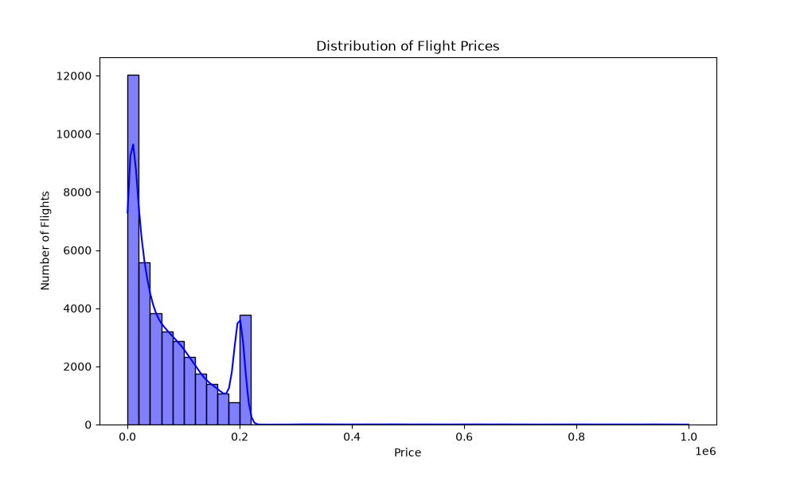
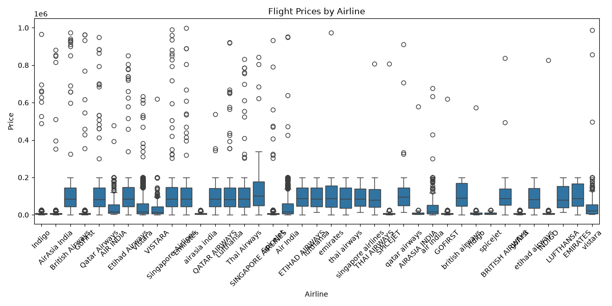
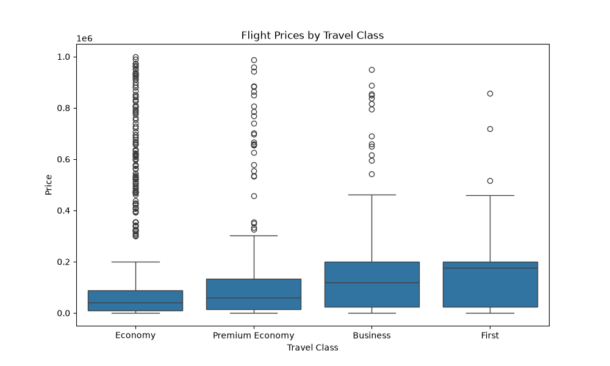

# AI Travel Analyst

## Project Overview
This project is part of the MIC AIML Department Recruitment Challenge (Track 3: Data Science and Visualization - Part 1). It focuses on exploring and analyzing flight pricing data to understand what drives ticket costs.

## Problem Statement
Flight prices are highly dynamic and fluctuate based on various factors. The goal of this project is to clean a raw flight pricing dataset, visualize the data, and identify the major factors that affect flight prices to help travelers make smarter decisions.

## Installation Instructions
1. Clone this repository to your local machine.
2. Ensure you have Python installed.
3. Open a terminal in the project folder and run:
   `pip install -r requirements.txt`
4. Open `notebooks/flight_analysis.ipynb` in VS Code or Jupyter Notebook to view the code.

## Dataset Used
* **Name:** `flight_pricing_dataset.csv`
* **Description:** Contains 100,000 raw records of flight details including airline, source, destination, duration, stops, travel class, and price.

## Methodology
1. **Data Cleaning:** Handled missing values, standardized text capitalization, and converted mixed text/number columns (`Duration`, `Total_Stops`) into usable numerical formats.
2. **Exploratory Data Analysis (EDA):** Created 5 visualizations to analyze the relationship between various features and the flight price.

## Technologies Used
* Python
* Pandas (Data manipulation)
* NumPy (Numerical operations)
* Matplotlib & Seaborn (Data visualization)
* Jupyter Notebook

## Results & Insights
Based on the visualizations, the major factors affecting flight prices are:
1. **Price Distribution:** Most flight prices are relatively low, but the distribution is highly skewed with a long tail of very expensive flights.
2. **Airline:** Premium airlines have higher median prices and wider price ranges, while budget airlines offer cheaper base fares.
3. **Travel Class:** Upgrading from Economy to First class significantly increases the price, though Economy has rare extreme high-priced outliers.
4. **Total Stops:** Flights with more stops have a slightly higher median price, but non-stop flights also contain many high-priced outliers.
5. **Days Before Departure:** Prices generally decrease the further in advance you book. Booking very close to the departure date (under 50 days) causes a massive spike in maximum prices.

## Challenges Faced
* **Dirty Data:** The `Duration` column had inconsistent formats (e.g., "3h 11m", "1.67", "177 min") which required custom parsing logic.
* **Mixed Types:** The `Total_Stops` column contained both text ("non-stop", "1 stop") and numbers, requiring standardization.
* **Inconsistent Capitalization:** Categorical features like Airline names had inconsistent casing (e.g., "Indigo" vs "INDIGO"), creating duplicates that had to be cleaned.

## Future Improvements
* Perform feature engineering to extract more details from departure dates and times.
* Build a machine learning prediction model to forecast exact flight prices based on the cleaned features.
* Create an interactive dashboard for users to explore the data dynamically.

## Screenshots
Here are the key visualizations generated during the analysis:

*Price Distribution*

*Airline vs Price*

*Class vs Price*
